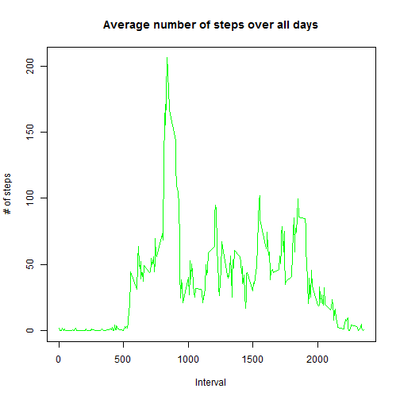

## Loading and preprocessing the data
* Load the data

```r
setwd("~/R/RepData_PeerAssessment1")
databrut <- read.csv(unz("activity.zip","activity.csv"))
```
* Process/transform the data (if necessary) into a format suitable for your analysis

```r
data <- databrut[ with (databrut, { !(is.na(steps)) } ), ]
```

## What is mean total number of steps taken per day?
* Calculate the total number of steps taken per day

```r
TotalStepsPerDay <- aggregate(steps ~ date, data = data, sum)
```
* If you do not understand the difference between a histogram and a barplot, research the difference between them. Make a histogram of the total number of steps taken each day

```r
hist(TotalStepsPerDay$steps, breaks = 6, main = "Histogram of the total number of steps taken each day", 
     xlab = "Total number of steps per day", ylab = "Frequency", col = "green")
```

 

* Calculate and report the mean and median of the total number of steps taken per day

```r
mean(TotalStepsPerDay$steps)
```

```
## [1] 10766.19
```

```r
median(TotalStepsPerDay$steps)
```

```
## [1] 10765
```
```
The mean of total number of steps per day is 10766.19 and the median is 10765.
```

## What is the average daily activity pattern?
* Make a time series plot (i.e. type = "l") of the 5-minute interval (x-axis) and the average number of steps taken, averaged across all days (y-axis)

```r
MeanStepsPerInterval <- aggregate(steps ~ interval, data = data, mean)
plot(steps ~ interval, data = MeanStepsPerInterval, type = "l", main = ("Average number of steps over all days"), xlab="Interval", ylab = "# of steps", col = "green")
```

 

* Which 5-minute interval, on average across all the days in the dataset, contains the maximum number of steps?

```r
MeanStepsPerInterval[which.max(MeanStepsPerInterval$steps), ]$interval
```

```
## [1] 835
```
```
The interval with the highest average steps is 835
```

## Imputing missing values
* Calculate and report the total number of missing values in the dataset (i.e. the total number of rows with NAs)

```r
sum(is.na(databrut$steps))
```

```
## [1] 2304
```
* Devise a strategy for filling in all of the missing values in the dataset. The strategy does not need to be sophisticated. For example, you could use the mean/median for that day, or the mean for that 5-minute interval, etc.

```r
intervalcustom <- function(interval) {
  MeanStepsPerInterval[MeanStepsPerInterval$interval == interval, ]$steps
}
```
* Create a new dataset that is equal to the original dataset but with the missing data filled in.

```r
newdata <- databrut  
count = 0  
for (i in 1:nrow(newdata)) {
  if (is.na(newdata[i, ]$steps)) {
    newdata[i, ]$steps <- intervalcustom(newdata[i, ]$interval)
    count = count + 1
  }
}
cat("Total ", count, "NA values were filled.\n\r")
```

```
## Total  2304 NA values were filled.
## 
```
# Total  2304 NA values were filled
* Make a histogram of the total number of steps taken each day 

```r
NewTotalStepsPerDay <- aggregate(steps ~ date, data = newdata, sum)
hist(NewTotalStepsPerDay$steps, breaks = 6, main = "Histogram of the total number of steps taken each day", 
     xlab = "Total number of steps per day", ylab = "Frequency", col = "green")
```

 

* Calculate and report the mean and median total number of steps taken per day

```r
mean(NewTotalStepsPerDay$steps)
```

```
## [1] 10766.19
```

```r
median(NewTotalStepsPerDay$steps)
```

```
## [1] 10766.19
```
```
The mean and the median of total number of steps per day are the same 10766.19
```
* Do these values differ from the estimates from the first part of the assignment? What is the impact of imputing missing data on the estimates of the total daily number of steps?
```
The mean value sill the same but the median value shows a little difference
```

## Are there differences in activity patterns between weekdays and weekends?
* Create a new factor variable in the dataset with two levels ? ?weekday? and ?weekend? indicating whether a given date is a weekday or weekend day.

```r
newdata$day = ifelse(as.POSIXlt(as.Date(newdata$date))$wday%%6 == 
                              0, "Weekend", "Weekday")
newdata$day = factor(newdata$day, levels = c("Weekday", "Weekend"))
```
* Make a panel plot containing a time series plot (i.e. type = "l") of the 5-minute interval (x-axis) and the average number of steps taken, averaged across all weekday days or weekend days (y-axis)

```r
StepsIntervalDay = aggregate(steps ~ interval + day, newdata, mean)
library(lattice)
xyplot(steps ~ interval | factor(day), data = StepsIntervalDay, aspect = 1/2, 
       type = "l")
```

 
```
There are some subtle differences between the average number of steps between weekdays and weekends. It appears that the user started a bit later on weekend with a smaller numbers.
```
